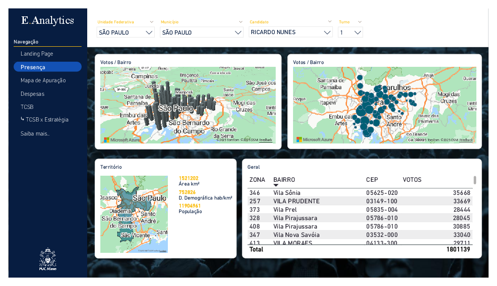
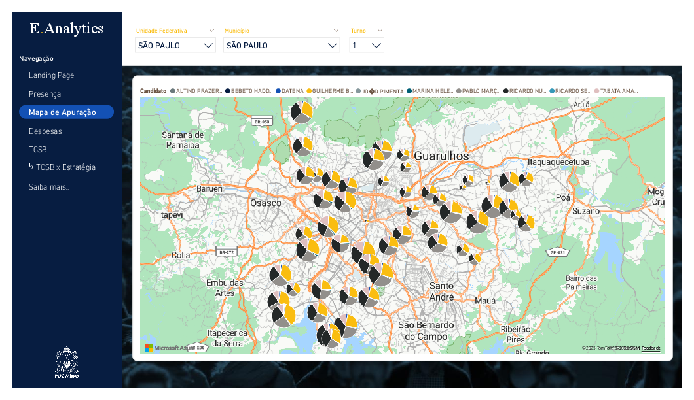
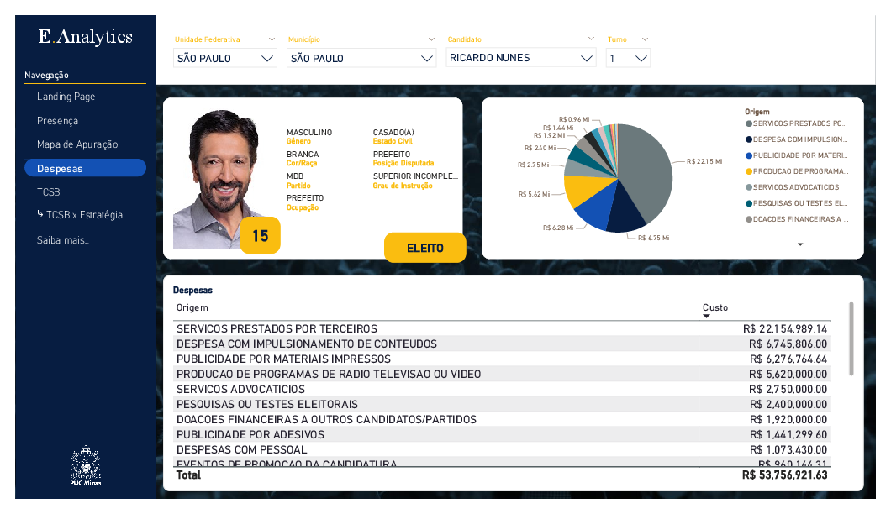
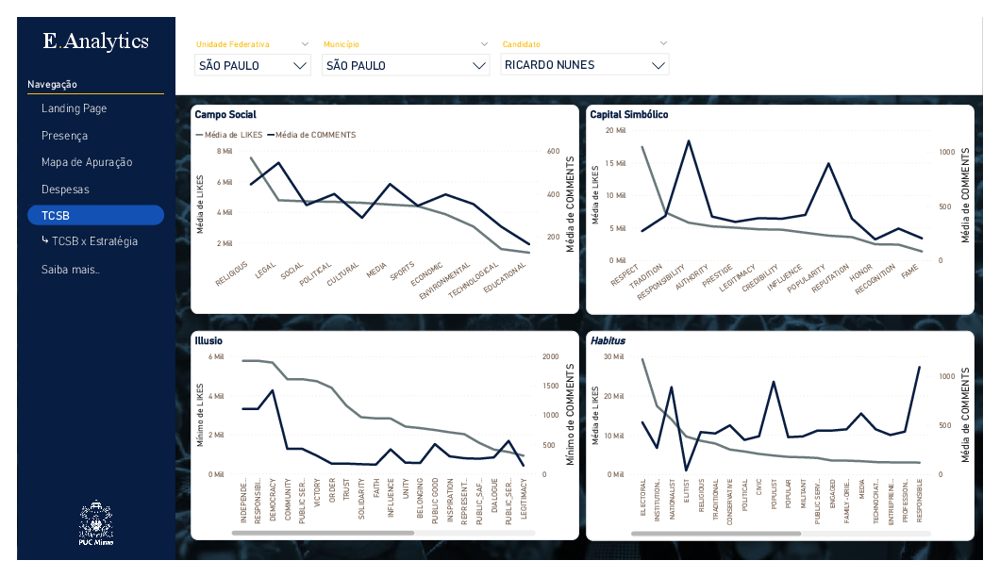
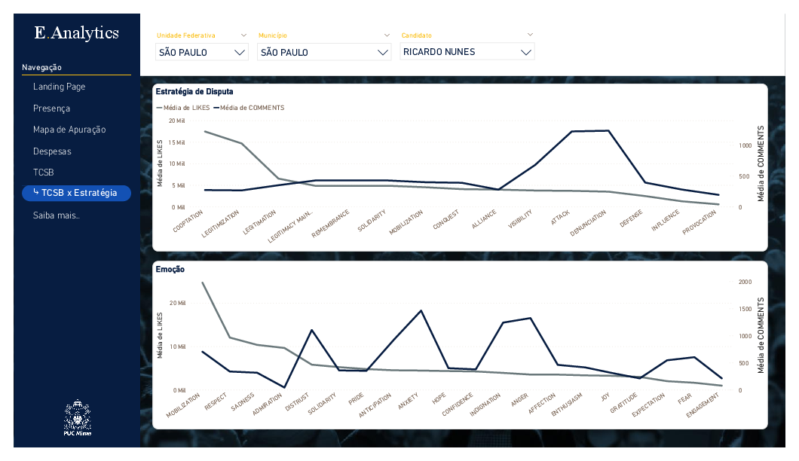

        <!-- 

        <h3>
                <a href="https://puc-cc-tcc.github.io/view/" target="_blank">
                        Website: Web Dashboard | E.Analytics
                </a>
        </h3>
        
 -->
        
         
        
        
        
        
        
        
        

